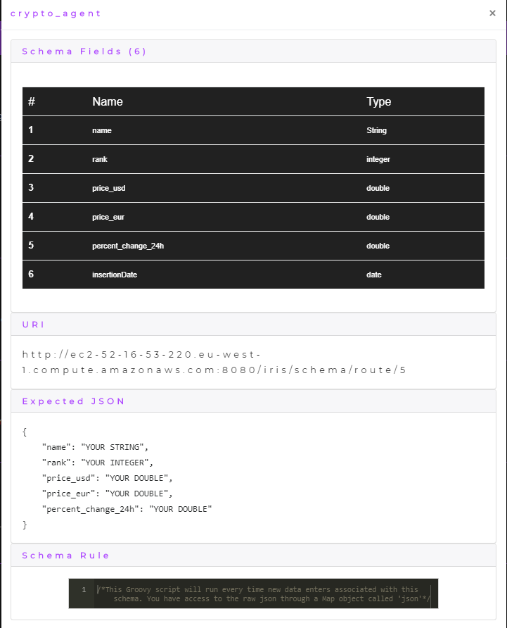
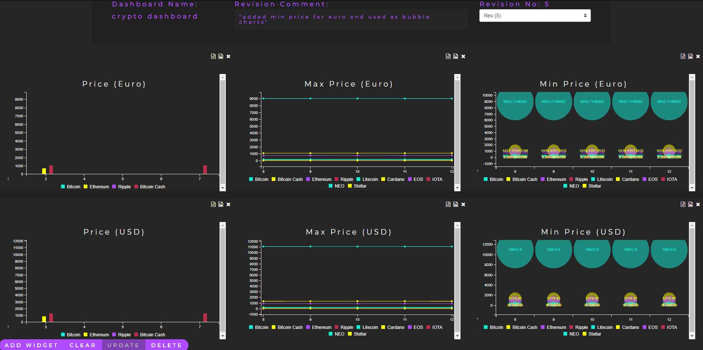

    

        
    

# Iris Crypto Currency Rates Agent

This repository contains the Crypto Currency Rate agent for my final year project [Iris](https://github.com/DeanGaffney/iris). This agent uses a python script to get the current crypto currency rates using the [cointmarketcap](https://pypi.org/project/coinmarketcap/) library. The crypto currency rates are then pushed to Iris where they are tracked on a dashboard in real time. 

## Agent Schema
The following is the schema that was created in Iris for the agent.

## Agent Dashboard
The following image shows the dashboard for the agent inside Iris where it is keeping track of the crypto currency rates.

## Agent Transformation Rule
This agent has no transformation rule, please see the [Node.js Agent](https://github.com/DeanGaffney/iris-node) for an example of a transformation rule.

## Other Iris agents
* [Selenium](https://github.com/DeanGaffney/iris-selenium)
* [Node.js](https://github.com/DeanGaffney/iris-node)
* [Android](https://github.com/DeanGaffney/iris-android)
* [MySQL](https://github.com/DeanGaffney/iris-mysql)

## Built With

- Python

## Authors

* **Dean Gaffney**

See also the list of [contributors](https://github.com/DeanGaffney/iris-crypto-rates/graphs/contributors) who participated in this project.